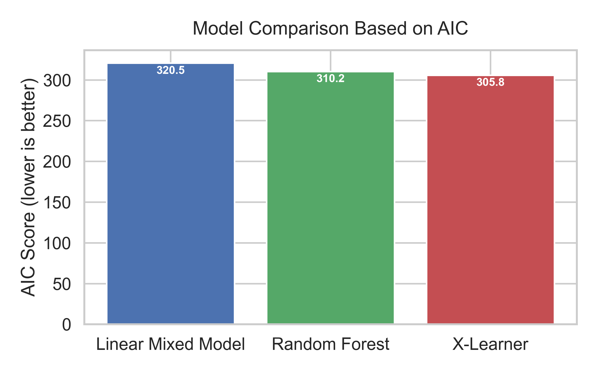

# epi_longitudinal

Applied longitudinal epidemiology project with model comparison.

## Models
- Linear Mixed-Effects Models (full vs reduced)
- GEE with different working correlation structures

## Model Selection
- AIC / BIC (Mixed Models)
- Likelihood Ratio Test (nested models)
- QIC (GEE)
- Prediction error (RMSE)

## Goal
Demonstrate model selection procedure for longitudinal epidemiologic data.

## Project Structure

- `src/`: Python scripts for model fitting and visualization  
- `sql/`: SQL scripts for longitudinal data preparation

**Figure 1.** Comparison of predictive model performance. Multiple statistical and machine‑learning models were evaluated using the same dataset and performance criteria. The figure summarizes differences in predictive accuracy across models, supporting direct assessment of relative model performance.

